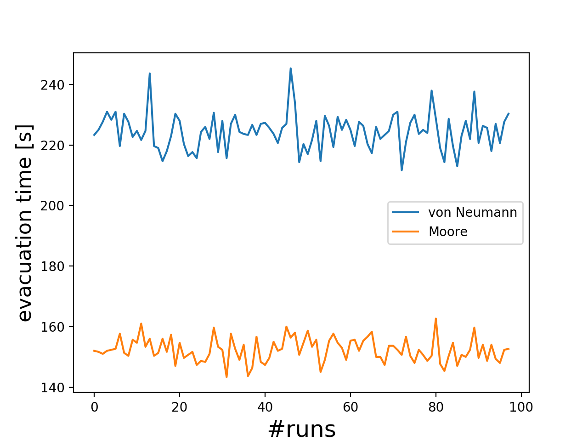

# Purpose

Implementation of some known cellular automata. Use for academic purposes only.
Work in progress ...


# Floor Field Model (cellular_automaton.py)

## Reference

Cellular Automaton. Floor Field Model [Burstedde2001] Simulation of
pedestriandynamics using a two-dimensional cellular automaton Physica A, 295,
507-525, 2001

## Usage

```
python cellular_automaton.py <optional arguments>
```
## Optional arguments:

| option          |  value                   | descrption                                                                    |
|-----------------|:------------------------:|------------------------------------------------------------------------------ |
|`-h, --help`     |                          | show this help message and exit                                               |
|  `-s, --ks`     | KS                       | sensitivity parameter for the Static Floor Field (*default 2*)                |
|  `-d, --kd`     | KD                       | sensitivity parameter for the Dynamic Floor Field (*default 1*)               |
|  `-n, --numPeds`| NUMPEDS                  | Number of agents (*default 10*)                                               |
|  `-p, --plotS`  |                          | plot Static Floor Field                                                       |
|  `--plotD`      |                          | plot Dynamic Floor Field                                                      |
|  `--plotAvgD`   |                          | plot average Dynamic Floor Field                                              |
|  `-P, --plotP`  |                          | plot Pedestrians                                                              |
|  `-r, --shuffle`|                          | random shuffle                                                                |
|  `-v, --reverse`|                          | reverse sequential update                                                     |
|  `-l, --log`    |  LOG                     | log file (*default log.dat*)                                                  |
|  `--decay`      |  DECAY                   | the decay probability of the Dynamic Floor Field (*default 0.2*)              |
|  `--diffusion`  |  DIFFUSION               | the diffusion probability of the Dynamic Floor Field (*default 0.2*)          |
|  `-W, --width`  |  WIDTH                   | the width of the simulation area in meter, excluding walls                    |
|  `-H, --height` | HEIGHT                   | the height of the simulation room in meter, excluding walls                   |
|  `-c, --clean`  |                          | remove files from directories dff/ sff/ and peds/                             |
|  `-N, --nruns`  |  NRUNS                   | repeat the simulation N times (*default 1*)                                   |
|  `--parallel`   |                          | use multithreading                                                            |
|  `--moore`      |                          | use moore neighborhood (*default Von Neumann*)                                |
|  `--box`        |  from_x to_x from_y to_y | Rectangular box defined by 4 numbers, where agents will be distributed. (*default the whole room*) |
                        
## Simulation results

With the following parameter: 
- Width of room: 30 m
- Hight of the room: 30 m 
- Number of runs: 1
- Number of pedestrians 2000
- Diffusion parameter: 2
- Decay parameter: 0.2
- Static FF parameter: 2
- Dynamic FF parameter: 5

Call: 

```
python cellular_automaton.py -W 30 -H 30  -N 1 -n 2000 --diffusion 2 --plotAvgD  --plotD -d 5 -s 2 -P
```
- Video
[simulation](https://youtu.be/fD4l9P24J1k)

- Dynamics floor field (averaged over time)


## Comparison of different neighborhoods

Call the script with the option `-moore` to use the moore neighborhood. Otherwise, von Neumann neighborhood will be used as default. 

The choice of the neighborhood has an influence on the evacuation time, as can seen below.



### Moore neighborhood (video)

[](https://youtu.be/DAzu7GkUjHc)

### von Neumann neighborhood (video)

[](https://youtu.be/tnQegJcclu0)

## Todos:
  - Different update schemes: sequential, shuffle sequential, reverse sequential.
  - visualisation of the cell states.
  - ~~todo~~: make a video from the png's
  - *todo*: track cells with _id_ for further trajectory analysis.
  - ~~todo~~: implement the dynamic floor field
  - *todo*: implement the parallel update.
  - todo: implement the conflict friction `mu`
  - *todo*: read geometry from a png file. See [read_png.py](geometry/read_png.py).
  
  
# ASEP model (asep_fast.py)

the Asymmetric Simple Exclusion Process (ASEP)

## Reference 
Rajewsky, N. and Santen, L. and Schadschneider, A. and Schreckenberg, M.
The asymmetric exclusion process: Comparison of update procedures
Journal of Statistical Physics, 1998

## Usage 

```
python asep_slow.py <optional arguments>
```
## Optional arguments:

| option          |  value                   | descrption                                                                    |
|-----------------|:-------------------------:|------------|
|  -`h, --help`  |  | show this help message and exit | 
|  `-n, --np`  | NUMPEDS |       number of agents (*default 10*)|
|  `-N, --nr` | NRUNS |         number of runs (*default 1*) |
|  `-m, --ms` | MS |  max simulation steps (*default 100*) |
|  `-w, --width`  |  WIDTH |  width of the system (*default 50*) | 
 | `-p, --plotP`  |  |  plot Pedestrians | 
 | `-r, --shuffle` | |          random shuffle|
 | `-v, --reverse` | |        reverse sequential update|
 | `-l, --log`   |  LOG |     log file (default *log.dat*) | 


## simulation results

the theoretical fundamental diagram can be reproduced, see [figure](figs/asep_fd.png). The size of the system should be reasonably high and the simulation time also.

## Todos
- *todo*: implement TASEP
- *todo*: implement sequential update with all its variants.
- Remarque: There are two implementations of the asep. One it optimized using vector-operations from `numpy` (`asep_fast.py`) and the other implementation is using explicit loops (`asep_slow.py`). The naming of the two variations is justified when measuring their execution time:
  ```
  python make_fd.py asep_fast.py:         0:56.71 real,   52.12 user,     4.03 sys
  python make_fd.py asep_slow.py:         1:15.42 real,   70.55 user,     4.23 sys
  ```
